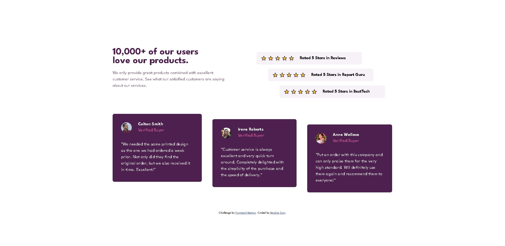
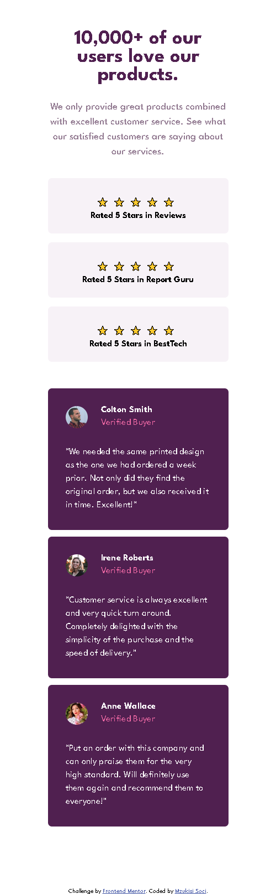

# Frontend Mentor - Social proof section solution

This is a solution to the [Social proof section challenge on Frontend Mentor](https://www.frontendmentor.io/challenges/social-proof-section-6e0qTv_bA). Frontend Mentor challenges help you improve your coding skills by building realistic projects.

## Table of contents

- [Overview](#overview)
  - [The challenge](#the-challenge)
  - [Screenshot](#screenshot)
  - [Links](#links)
- [My process](#my-process)
  - [Built with](#built-with)
  - [What I learned](#what-i-learned)
  - [Continued development](#continued-development)
- [Author](#author)

**Note: Delete this note and update the table of contents based on what sections you keep.**

## Overview

### The challenge

Users should be able to:

- View the optimal layout for the section depending on their device's screen size

### Screenshot

### Links

- Solution URL: [https://github.com/Mzu-Soci/Social-proof-section]
- Live Site URL: [https://mzu-soci.github.io/Social-proof-section/]

## My process

-add divs for each section from top to bottom
-add all body html tags
-style all tags on style sheett
-add media queries for mobile site
-add media queries for desktop site

### Built with

- Semantic HTML5 markup
- CSS custom properties
- Flexbox
- Mobile-first workflow

### What I learned

Using absolute and relative positioning

### Continued development

How to use star emojis without black border

## Author

- Frontend Mentor - [@Mzu-Soci](https://www.frontendmentor.io/profile/Mzu-Soci)
- LinkedIn - [Mzukisi Soci](https://www.linkedin.com/in/mzukisi-soci-308521140/)
